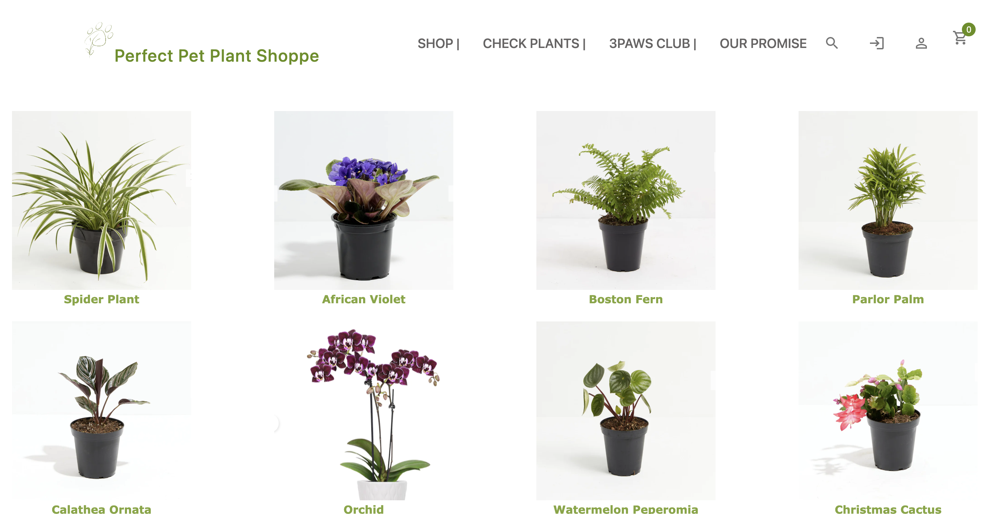
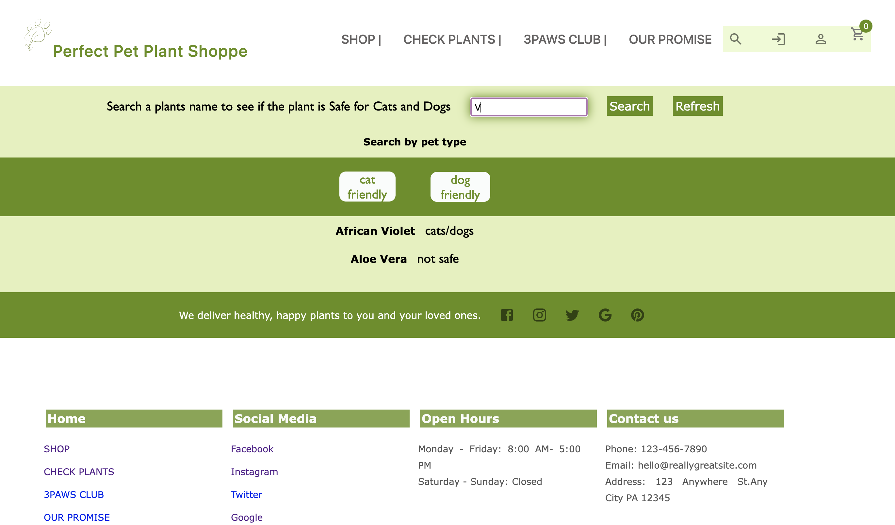
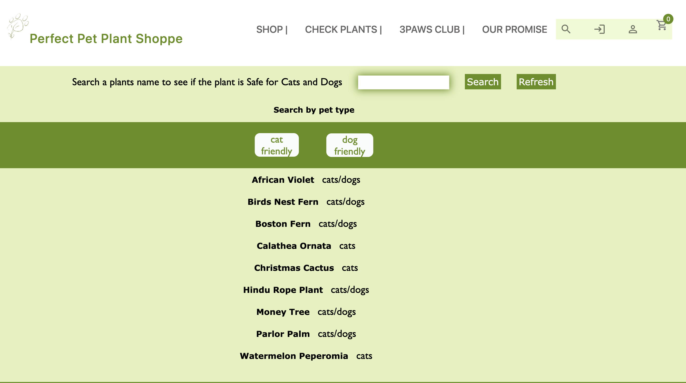
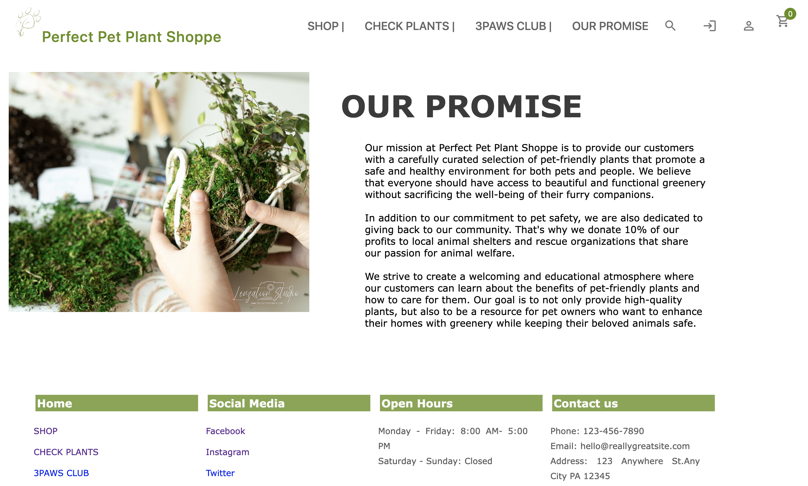

# Pet Plant Shoppe

# User Story

USER STORY

As a business owner, I want to create a website for my Pet Friendly Nursery Store. People can visit my website when they are planning to buy indoor plants and they want to know if their prospect plant is safe for their pet.

When planning to buy plants, sometimes pet owners initially don’t consider if the plant they want to buy is safe for their pets. Furthermore, sometimes when a pet gets sick, veterinarians need as much information as possible to be able to help the animals. Users can also use my website to look for the plant they already have at home to see if the plant is pet friendly or if the plant had something to do with the pet being sick.

Buying a plant at our pet friendly nursery shop guarantees a safe environment for your
pet. In addition, we partner with SPCA so we can donate 50% of the sales when you buy a plant.

## Table of Contents

- [Usage](#usage)
- [Mock-Up](#mock-up)
- [Finished Product](#finished-product)
- [Credits](#credits)
- [License](#license)

## Usage

Open the hope page of the website.
click on the SHOP button to see the plants collections, when you click on each plant, a card with the picture and extra information will open.
When you scroll down, you can add the plant to a shopping cart and add it as favorite. You will have to be signed in to be able to complete the purchase.
To sign in, click on the door icon on the top right. If you are an existing user On the CHECK PLANTS section, you can use the search bar to look for plants that you already have at home to find out if they are either safe or not for either animal. Refresh the search bar after you are done.
Below the search bar, click on the "cat friendly" button, it will show a list of plants that are safe for cats even if they are also safe for dogs.
If you click on the "dog friendly" button, it will show the plants that are safe for dogs, even is they also are safe for both animals.
Click on the 3PAWS CLUB button, to see the upcoming Newsletter and being part of the customer conversations that will take place in the near future.
Click on OUR PROMISE button, it will take you to the Company's mission statement.
CLick on the banner on the top left to return to the home page.
On the Home page, explore our social media platforms, open hours and contact information at the bottom of the page.

## Mock-Up

The following image shows the finished product

## Finished-product

Here is the link of the finished work:

[Deployed website](https://afternoon-coast-06929.herokuapp.com/)

## Credits

Muchir Bickel (Front-End)
Paul A. Hagan (Front-End)
Natalia Venkatesh (Back-End)
Angelica Ibarra (Back-End)
Alejandro Asencio (Back-End)

## License

MIT License

Copyright (c) 2022

Muchir Bickel
Paul Hagan
Natalia Venkatesh
Angelica Ibarra
Alejandro Asencio

Permission is hereby granted, free of charge, to any person obtaining a copy
of this software and associated documentation files (the "Software"), to deal
in the Software without restriction, including without limitation the rights
to use, copy, modify, merge, publish, distribute, sublicense, and/or sell
copies of the Software, and to permit persons to whom the Software is
furnished to do so, subject to the following conditions:

The above copyright notice and this permission notice shall be included in all
copies or substantial portions of the Software.

THE SOFTWARE IS PROVIDED "AS IS", WITHOUT WARRANTY OF ANY KIND, EXPRESS OR
IMPLIED, INCLUDING BUT NOT LIMITED TO THE WARRANTIES OF MERCHANTABILITY,
FITNESS FOR A PARTICULAR PURPOSE AND NONINFRINGEMENT. IN NO EVENT SHALL THE
AUTHORS OR COPYRIGHT HOLDERS BE LIABLE FOR ANY CLAIM, DAMAGES OR OTHER
LIABILITY, WHETHER IN AN ACTION OF CONTRACT, TORT OR OTHERWISE, ARISING FROM,
OUT OF OR IN CONNECTION WITH THE SOFTWARE OR THE USE OR OTHER DEALINGS IN THE
SOFTWARE.
